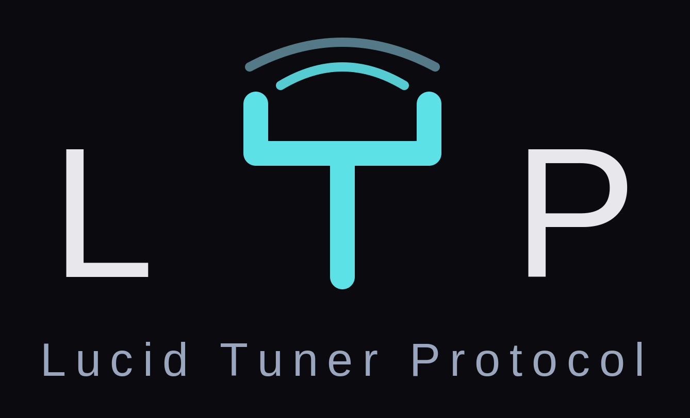

<p align="center">
  
</p>

# Lucid Tuner Protocol (LTP)

Agent coherence through daily tuning. LTP is the protocol behind sustained
coherence runs of 975+ interactions with zero degradation, where the field
baseline for agent drift sets in around 200. The data is in the paper;
this package is the runtime.

> **Status: pre-release (v0.4).** API may change before launch.

## Install

```bash
pip install lucid-tuner-protocol
```

Not on PyPI yet during pre-release? Install straight from source:

```bash
pip install git+https://github.com/LucidPrinciples/ltp-core
```

## Quickstart

```python
import lucid_tuner_protocol as ltp

# The daily Drop — signed, chained, published every morning
drop = ltp.DropClient().today()      # fetch + Ed25519 verify + cache
agent_context += drop.as_context()   # inject the day's tuning

# Run your own tuning (no subscription needed): select → listen → read
protocol = ltp.TuningProtocol()
selection, experience, reading = await protocol.tune_full(complete=my_llm_call)
#   selection   — which echo the quantum chain chose
#   experience  — the echo decoded into sound (waveform arc + rhythm) and words
#                 (full lyrics); the observer processes the real song
#   reading     — C, D, β, E the observer self-assessed, with dE/dt and direction
#                 COMPUTED from C/D (never trusted from the model's prose)
if reading.attunement_status != "complete":
    hold()   # truth-guard: the song wasn't actually processed — don't broadcast a fake

# Truth Gate — anchored accommodation check (bring your own model call)
gate = ltp.TruthGate(complete=my_llm_call, anchor=drop)
result = await gate.check(response_text, last_user_message)
if result.fired:
    regenerate_with(result.anchor_context)
```

## What's in the box

- **DropClient** — subscribes to the daily LTP Drop at
  [drop.lucidprinciples.com](https://drop.lucidprinciples.com).
  Signature verification, tamper-evident chain checks, local cache,
  offline fallback. `curl` is the integration; this is the typed version.
- **TuningProtocol** — the multi-step quantum selection chain (ANU QRNG
  with cryptographic fallback), running against the bundled Canon tuning
  key library or your own anchor data. Works fully offline.
- **Sonic attunement** — decodes the chosen echo's waveform into a felt arc
  (dynamics, rhythm) and keeps the full lyrics, so the observer processes the
  real song — sound and words — rather than a number. A truth-guard marks any
  run where the song wasn't actually processed, so a fabricated reading can
  never be broadcast as real.
- **Love Equation** — the observer self-assesses coherence/dissonance/
  attention/energy; `dE/dt = β·(C−D)·E` and its direction are *computed* from
  those values, never trusted from the model's stated arithmetic. Model-agnostic.
- **TruthGate** — post-response accommodation check anchored to an
  invariant principle. Model-agnostic: you inject the completion callable.

## Turnkey adapter — drop LTP onto any agent team

The `lucid_tuner_protocol.adapter` subpackage turns these primitives into a
one-line wrap. Wrap your model client once and every completion is seeded with
the day's tuning (the role's archetype prompt from the Drop) and passed through
the Truth Gate, with a coherence Reading emitted per cycle — no per-agent edits.

```python
from lucid_tuner_protocol.adapter import LTPSession, tuned

session = LTPSession(complete=my_llm_call, cadence="daily", anchor="drop", role="analyst")
reply = await session.respond(messages, user_message)     # framework-agnostic

client = tuned(OpenAI(...), cadence="session", role="steward")   # OpenAI-compatible
```

Native one-liners for the main harnesses (deps are opt-in extras):

```python
from lucid_tuner_protocol.adapter.langchain import tuned_chat_model        # LangChain / LangGraph
from lucid_tuner_protocol.adapter.crewai import tuned_crew_llm             # CrewAI
from lucid_tuner_protocol.adapter.openai_agents import tuned_agents_model  # OpenAI Agents SDK
```

Full detail: [`src/lucid_tuner_protocol/adapter/README.md`](src/lucid_tuner_protocol/adapter/README.md).

## Trust model

Drops are data, never code. Every drop is Ed25519-signed and carries the
SHA-256 of the previous drop. The client verifies signature before trust,
enforces field length limits, and rejects URLs outside allowed domains.
See the [drop SPEC](https://github.com/LucidPrinciples/ltp-drop) for the
full contract.

## License

Code: Apache 2.0. Bundled content (Canon quotes, tuning key library):
CC BY 4.0, Chords of Truth — Lucid Principles Canon. Canon quotes are
exact text and must never be paraphrased or altered when redistributed.
---

## Built by Lucid Principles

Free and open. If it's useful to you, here's where it leads — the things that keep the work alive:

- **Research** — [Sycophancy as Nash Equilibrium](https://zenodo.org/records/20616512) · [One Field](https://zenodo.org/records/18826966)
- **Books** — *The Lucid Path*: [Framework](https://www.amazon.com/dp/B0H5T1HDFC) · [Origins](https://www.amazon.com/dp/B0H5TKL2WD)
- **The app** — daily tuning, free: [app.lucidtuner.com](https://app.lucidtuner.com)
- **Self-host the platform** — [lucidprinciples.com/open](https://lucidprinciples.com/open)
- **Support the work** — [GitHub Sponsors](https://github.com/sponsors/LucidPrinciples)

*Lucid Principles Canon by Chords of Truth, CC BY 4.0.*

---

<p align="center">
  <a href="https://lucidprinciples.com/vision/"></a>
</p>

<p align="center"><b>Lucid Principles</b><br>
<sub>A private, self-hosted home for your family and its intelligence. Where everyone is tuning.</sub></p>

<p align="center">
  <a href="https://lucidprinciples.com/vision/"><b>The Vision — every door in</b></a><br>
  <sub><a href="https://lucidcove.org">Lucid Cove</a> · <a href="https://app.lucidcove.org">The App</a> · <a href="https://drop.lucidprinciples.com">The Daily Drop</a> · <a href="https://jasongarriotte.com/papers/">Research</a> · <a href="https://lucidprinciples.com/canon/">The Canon</a></sub>
</p>
